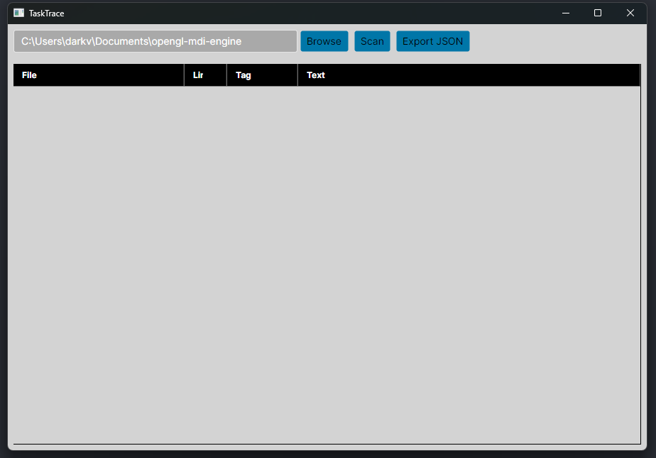

# 🧭 TaskTracer

**TaskTracer** is a lightweight desktop tool built with **Avalonia** and **ReactiveUI** that scans your source code for `TODO` comments and organizes them in one place.  
It’s perfect for developers who want to quickly find unfinished tasks or reminders scattered throughout their codebase.



---

## ✨ Features

- 🔍 **Scan any folder** for TODO comments across multiple files.  
- 📂 **Browse folders** easily using a native folder picker.  
- 📝 **View and export** all TODOs to a JSON file.  
- 💾 **Remembers your last used folder** between sessions.  
- ⚡ Built with **.NET + Avalonia**, runs on Windows, macOS, and Linux.

---

## Quick start:
download the Exe from the releases Tab on Github

## 🚀 Getting Started

### 1. Clone the repository
```bash
git clone https://github.com/yourusername/TodoScan.git
```

### 2. build the project
in the project root do the following:
```bash

dotnet restore TaskTrace.sln
dotnet build TaskTrace.sln --configuration Release
dotnet run --project ./TaskTrace/TaskTrace.csproj
```


